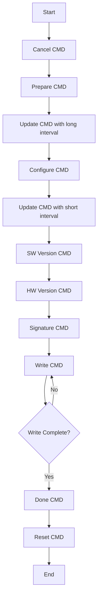

# OTA App Development Guide

## Overview

This document provides a comprehensive guide for implementing OTA (Over-The-Air) upgrades using an Android application. It details the OTA service structure, command protocols, error handling, and firmware file format required to upgrade the device software reliably.

---

## OTA Service

**UUID:**  
OTA Service: `f95a48e6-a721-11e9-a2a3-022ae2dbcce4`

**Note:** All data bytes are in little-endian format.

### Characteristics

| Name          | Property | Max Length | UUID                                    | Description                                      |
|---------------|----------|------------|-----------------------------------------|--------------------------------------------------|
| SW/HW Version | Read     | 8          | f95a4b66-a721-11e9-a2a3-022ae2dbcce4    | Contains the software and hardware version info  |
| OTA CMD       | Write    | 524        | f95a5034-a721-11e9-a2a3-022ae2dbcce4    | Command structure for OTA operations             |
| OTA Error     | Notify   | 8          | ec4cff6d-81fc-4e5b-91e0-8103885c9ae3    | Notifies error codes during OTA                  |

---

## SW/HW Version

| SW Version (4 bytes) | HW Version (4 bytes) |
|----------------------|----------------------|

This characteristic reports the current software and hardware versions from the device, which helps determine whether an update is needed.

---

## OTA CMD

### Command Structure

| Field | Size (bytes)  | Description                           |
|-------|---------------|---------------------------------------|
| CMD   | 4             | Command code                          |
| Data  | 0–520         | Variable-length data payload          |

**Result Notification:**  
The command execution result is sent via GATT Notify using the **OTA Error** characteristic.

### Command List

1. #### Prepare Command (0x06)
   - **Description:** Prepares the device for OTA. This command must be issued before any other OTA commands.
   - **Format:**
     | CMD:0x06  (4 bytes)|
     |------------|

2. #### Configure Command (0x00)
   - **Description:** Configures OTA parameters such as firmware size and update flags.
   - **Format:**
     | CMD:0x00 (4 bytes) | Firmware Size (4 bytes) | Flag (4 bytes) |
     |------------|-------------------------|----------------|
   - **Parameters:**
     - **Firmware Size:** Total size of the upgrade file.
     - **Flag:** Configuration flags (see table below).
   - **Flag Values:**

     | Name              | Bit | Description                                                          |
     |-------------------|-------|----------------------------------------------------------------------|
     | Reserve           | 0   | Reserved (should be set to 0)                                        |
     | HASH              | 1   | Set to 1 to enable hash verification (only for IN6XX)                |
     | Flash Verify      | 2   | Set to 1 to enable flash verification                                |
     | Force Erase Flash | 3   | Set to 1 to force erase the flash                                   |
     | CRC               | 4  | Set to 1 to enable CRC checking (only for IN6XXE)                      |

     **Note:** It is recommended to set the flag to `0x1A` (CRC | HASH | Force Erase Flash).

3. #### Signature Command (0x08)
   - **Description:** Sends the upgrade file’s signature.
   - **Format:**
     | CMD:0x08 (4 bytes) | Signature (64 bytes) |
     |------------|----------------------|
   - **Note:** If the device does not support signature checking, this command may return an `OTA_ERR_INVALID_PARAM` error, which can be safely ignored.

4. #### Software Version Command (0x09)
   - **Description:** Sends the software version to the device. If an error is returned, cancel the OTA process.
   - **Format:**
     | CMD:0x09  (4 bytes) | SW Version (4 bytes) |
     |------------|----------------------|

5. #### Hardware Version Command (0x0A)
   - **Description:** Sends the hardware version to the device. If an error is returned, cancel the OTA process.
   - **Format:**
     | CMD:0x0A  (4 bytes) | HW Version (4 bytes) |
     |------------|----------------------|

6. #### Write Command (0x01)
   - **Description:** Writes firmware data to the device’s flash memory.
   - **Format:**
     | CMD:0x01 (4 bytes) | Address (4 bytes) | Data (4–512 bytes) |
     |------------|-------------------|--------------------|
   - **Parameters:**
     - **Address:** Flash offset address (starting at 0).
     - **Data:** Data payload (must be 4-byte aligned).
  
**Note**:
	If this command completes successfully, it will not send a GATT notify through the OTA error characteristic. A GATT notify is only sent in case of an error.

1. #### Done Command (0x02)
   - **Description:** Finalizes the OTA process and write the configuration to flash memory.
   - **Format:**
     | CMD:0x02  (4 bytes) | *optional* Hash Value(32 bytes)|
     |------------|-------|

	- **Note**:
		The 32-bytes hash value is optional and is only available when the **Hash** bit is set to 1 in the **Configure Command**. Compute the hash value using SHA-256 on the application data.

2. #### Cancel Command (0x03)
   - **Description:** Cancels the current OTA process and resets the device state.
   - **Format:**
     | CMD:0x03  (4 bytes) |
     |------------|
   - **Note:** After cancellation, issue a Prepare Command to restart the OTA process.

3. #### Reset Command (0x04)
   - **Description:** Resets the device.
   - **Format:**
     | CMD:0x04  (4 bytes) |
     |------------|

4.  #### Update Command (0x05)
    - **Description:** Updates BLE connection parameters.
    - **Format:**
      | CMD:0x05  (4 bytes) | Interval Min (4 bytes) | Interval Max (4 bytes) | Latency (4 bytes) | Timeout (4 bytes) |
      |------------|------------------------|------------------------|-------------------|-------------------|
    - **Parameters:**
      - **Interval Min:** Minimum connection interval (N × 1.25ms).
      - **Interval Max:** Maximum connection interval (N × 1.25ms).
      - **Latency:** Number of connection events that can be skipped.
      - **Timeout:** Supervision timeout (N × 10ms).
    - **Usage Notes:**
      - Set a long connection interval (e.g., >500ms) before sending the Configure Command.
      - After configuration, reduce the connection interval (e.g., to 30ms) to accelerate the OTA data transfer.

---

## OTA Error

The OTA Error characteristic notifies the application of errors that occur during the OTA process.

| Field      | Size (bytes) | Description                   |
|------------|--------------|-------------------------------|
| Command | 1            | OTA Command      |
| Error Code | 1            | Identifier for the error      |
| Reserved | 2| Reserved data
| Data       | 4            | Additional error data         |

### Error Codes

| Error Code | Description                             |
|------------|-----------------------------------------|
| 0x00       | No error                                |
| 0x01       | Wrong status (device is busy)           |
| 0x02       | Invalid parameter                       |
| 0x03       | Flash write error                       |
| 0x04       | Flash erase error                       |
| 0x05       | Initialization error                    |
| 0x06       | Memory error                            |
| 0x07       | AES error                               |
| 0x08       | Hash error                              |
| 0x09       | Flash verification error                |
| 0x0A       | Signature error                         |
| 0x0B       | Software version error                  |
| 0x0C       | Hardware version error                  |
| 0x0D       | Hardware error                          |
| 0x0E       | CRC error                               |
| 0x0F       | Timeout error                           |
| 0x10       | All devices timeout error               |

---

## Upgrade BIN File Format

The upgrade binary file is divided into up to three sections, as described in the table below:

| Section                | Size (bytes) | Description                                                                                                          |
|------------------------|--------------|----------------------------------------------------------------------------------------------------------------------|
| OTA Header (Optional)  | 128          | Contains metadata for the upgrade. This section is optional and its presence is determined by checking a magic word.    |
| Bootram (Optional)     | 16K          | Contains bootloader data. This section is optional and must be verified using a magic word. If present, it is discarded. |
| Application            | 4 – 240K     | Contains the application data, which is transmitted to the device using the Write Command.                           |

**Notes:**

- **OTA Header:**  
  If the first 4 bytes match the expected magic word, the OTA header is considered present. Otherwise, default values (such as zeros) should be used for software version, hardware version, and signature.

- **Bootram:**  
  This section, if present, includes additional bootloader code but should not be transmitted to the device. Always check the magic word to determine its validity.

- **Application:**  
  Only the application data section is sent to the device during the OTA process via the Write Command.

1. **OTA Header (Optional, 128 bytes)**

   | Field         | Size (bytes) | Description                                                                                       |
   |---------------|--------------|---------------------------------------------------------------------------------------------------|
   | Magicword     | 4            | Should be `0xA9D8194E`. If not, the OTA header is considered absent.                              |
   | SW Version    | 4            | Software version (sent in the Software Version Command).                                          |
   | HW Version    | 4            | Hardware version (sent in the Hardware Version Command).                                          |
   | Signature     | 64           | Signature of the upgrade file (sent in the Signature Command).                                    |
   | Reserve Data  | 52           | Reserved for future use.                                                                          |

2. **Bootram (Optional, 16KB)**

   The Bootram section begins with a 4-byte magic word.  
   
   | Field     | Size (bytes) | Description                                                                                   |
   |-----------|--------------|-----------------------------------------------------------------------------------------------|
   | Magicword | 4            | Should be `0xA72E0129` or `0x531b7635`. If the magicword does not match, Bootram is absent.    |
   | Data      | 16KB - 4     | Bootram content. **Do not send** Bootram data to the device; discard this section if present.  |

3. **Application**

   Only the application data should be transmitted to the device using the Write Command.

---

## OTA Process Flowchart

Below is a flowchart illustrating the OTA upgrade process:

  
### Best Pracitce
1. The first cancel command is used to cancel last OTA process.
2. Use the following parameter of Update CMD with long interval. And add 5 seconds delay after update command.
  - Interval min: 500
  - Interval max: 530
  - Latency: 0
  - Timeout：2000
  
3. Use OS API to set shorter connect interval.For example, use `requestConnectionPriority(BluetoothGatt.CONNECTION_PRIORITY_HIGH)` instead of `update CMD with shot interval` on Android system.
4. If bin file is not 4 bytes aligned, pad zero at the end of the bin file.
5. If get error, send cancel command.
6. Suggeset to set flag to 0x1A(CRC|HASH|Force Erase).